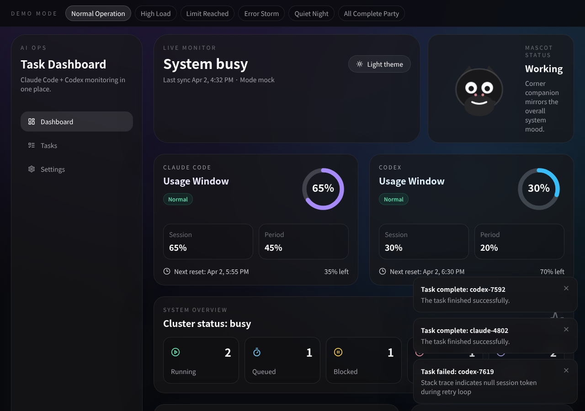
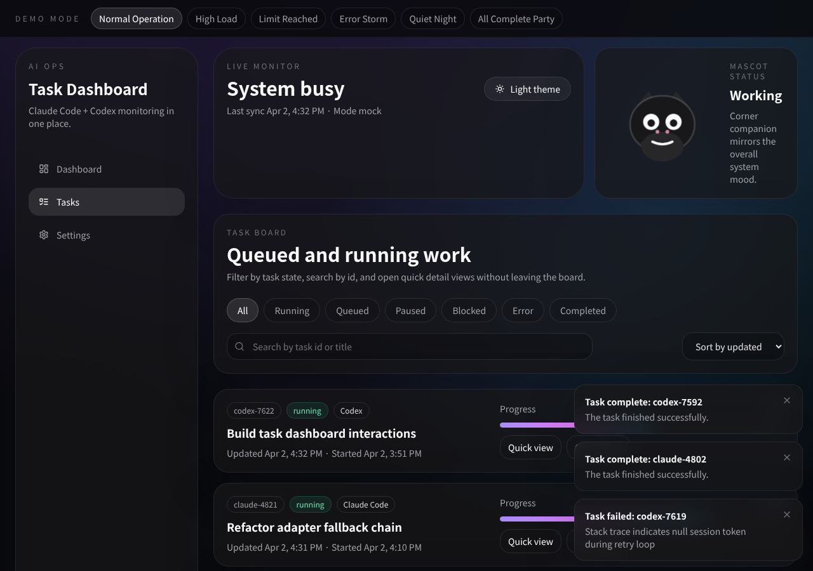
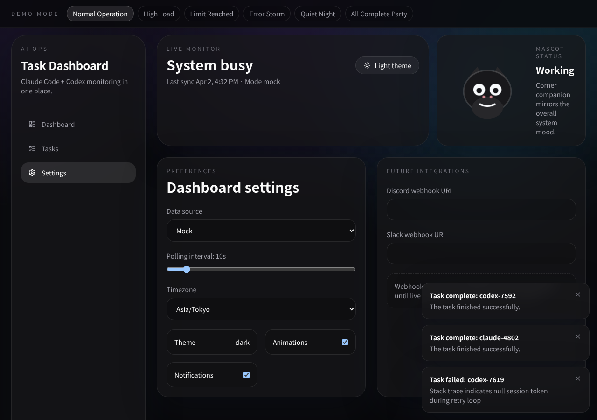

# AI Task Dashboard

## スクリーンショット

### ダッシュボード


### タスク一覧


### 設定画面


---

Claude Code と Codex のタスク状況・使用率・キャラクターアニメーションを一画面で確認できる、ダークモードの Next.js ダッシュボードです。

## 技術スタック

- Next.js 14 App Router
- TypeScript
- Tailwind CSS
- shadcn スタイルの UI コンポーネント
- date-fns
- Lucide icons
- カスタムストア・ポーリング層

## 起動方法

```bash
cd /home/sato-fox/codex/ai-task-dashboard
npm run dev
```

## 画面一覧

| パス | 説明 |
|------|------|
| `/` | ダッシュボード概要 |
| `/tasks` | タスク一覧（フィルタ・クイックビュー付き）|
| `/tasks/[id]` | タスク詳細 |
| `/settings` | 設定画面 |

## デモシナリオ

画面上部のデモバーからシナリオを切り替えられます。

| シナリオ | 内容 |
|----------|------|
| Normal Operation | 通常稼働状態 |
| High Load | 高負荷状態 |
| Limit Reached | 制限到達・キャラクターが力尽きる |
| Error Storm | エラー多発状態 |
| Quiet Night | 深夜の静かな状態 |
| All Complete Party | 全タスク完了お祝い状態 |

各シナリオは、システム状態・タスクステータス・使用率を一括で上書きします。

## データアダプター

アダプターの登録は [`lib/adapters/index.ts`](lib/adapters/index.ts) で管理しています。

| アダプター | 説明 |
|------------|------|
| `mockAdapter` | リアルな遅延付きのモックデータを返す |
| `claudeCodeAdapter` | ローカルファイルを読もうとし、失敗時はモックにフォールバック |
| `codexAdapter` | 同上（Codex 向け） |

実データに差し替える場合は、プロバイダーアダプター内のファイル読み込みロジックを置き換えるだけです。`IDataAdapter` インターフェースさえ守れば他のコードは変更不要です。

## 設定の永続化

設定は [`stores/settingsStore.ts`](stores/settingsStore.ts) を通じて localStorage に保存されます。

保存される項目:
- データソース
- ポーリング間隔
- タイムゾーン
- テーマ
- アニメーションのON/OFF
- 通知のON/OFF
- デモシナリオ

## キャラクター

キャラクターの SVG と状態マッピングは以下のファイルにあります。

- [`components/character/CharacterDisplay.tsx`](components/character/CharacterDisplay.tsx)
- [`components/character/CharacterContext.tsx`](components/character/CharacterContext.tsx)

| 状態 | アニメーション |
|------|--------------|
| idle | ふわふわ待機・瞬き |
| working | タイピング・左右に動く |
| completed | ジャンプ・キラキラ演出 |
| warning | 震える・汗マーク |
| limit-reached | 力尽きて倒れる・電池切れ |
| error | しょんぼり・バグアイコン |

## モックデータ・デモ

- モックデータ: [`lib/mock/mockData.ts`](lib/mock/mockData.ts)
- デモシナリオ: [`lib/mock/demoScenarios.ts`](lib/mock/demoScenarios.ts)
- ポーリング: [`lib/hooks/useDataPolling.ts`](lib/hooks/useDataPolling.ts)

## ビルド確認

```bash
npm run build
```

## 実データ接続について

ライブデータを使いたい場合は、`ai-task-dashboard/data/` 以下にローカルアダプター用のファイルを置き、各プロバイダーアダプターがそのファイルや API を参照するように更新してください。
